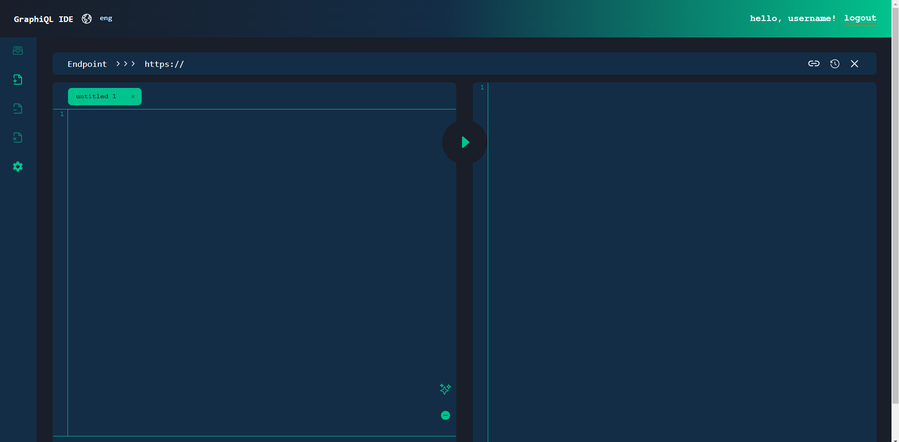

# GraphiQL

## Final task in RS-School React 2023Q4

GraphiQL is a playground/IDE for graphQL requests. Is an open-source tool that
also include:

- Authorization and authentication capabilities, ensuring access to the tool is restricted to authorized users.
- Work with a user-specified open GraphQL endpoint.

## Technologies stack:

- TypeScript
- React
- Vite
- Prettier
- ESlint
- Husky
- Jest

## Available scripts:

This project was bootstrapped with Vite.

In the project directory, you can run:

`npm run dev`  
Runs the app in the development mode.
Open http://localhost:5173/ to view it in the browser.
The page will reload if you make edits.
You will also see any lint errors in the console.

`npm test`  
Launches the test runner in the interactive watch mode.
See the section about running tests for more information.

`npm run lint`
Runs a code style and syntax check on your code using a linter. A linter is a tool that helps identify and fix potential issues and stylistic inconsistencies in your code. The results of the check will be displayed in the console. This is useful for maintaining clean and consistent code in your project.

`npm run fix`
Formats your code using Prettier, an opinionated code formatter. Prettier helps maintain a consistent and clean code style throughout your project. The results of the formatting will be displayed in the console.

`npm run build`  
Builds the app for production to the build folder.
It correctly bundles React in production mode and optimizes the build for the best performance.
The build is minified and the filenames include the hashes.
Your app is ready to be deployed!
See the section about deployment for more information.

## Prerequisites

1. Access to a Firebase project and the Firebase Console. If you do not have a Firebase project, you need to set up our it.
2. Node.js (version 10 or later) must be installed on your computer.

## Setting up and running the project locally:

Clone repo  
`$ git clone https://github.com/xu69ux/graphiql-app.git`

Change directory  
`$ cd graphiql-app`

Switch to the develop branch  
`$ git checkout develop`

Install all dependencies  
`$ npm install`

Run  
`$ npm run dev`

## Our team:

1. Kseniya (spiridonova.kseniya@gmail.com)
2. Artem (artem@mikolyuk.com)
3. Dmitry (dbox.insight@gmail.com)

Special heartfelt thanks to Viachaslau Shpileuski (https://github.com/slavajsfe) for valuable advice and implicit motivation for multiple refactoring.
